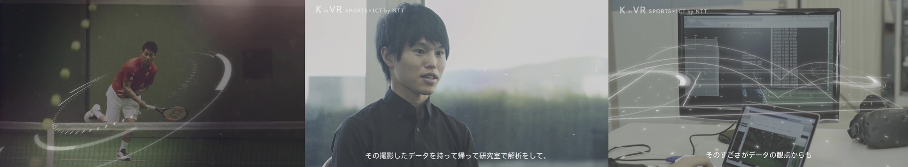

+++
menu = "main"
title = "Misc"
type = "misc"
weight = 10
+++

### Invited Talks

1. Key note talk in [Symposium on Bio-Navi 2024](https://bio-navigation.jp/navisympo2024/). (to appear)
1. "IoT and image processing technologies that support labor-saving and efficient aquaculture. (水産養殖の省力化・効率化を支えるIoT・画像処理技術)", ViEW, Dec, 2022
1. "AI・sensing technologies contributing to sustainable aquaculture. (持続可能な水産養殖に貢献する AI・センシング技術)", IIEEJ, Oct, 2022
1. "Toward realizing IoT・AI device available 365 days in an offshore aquaculture environment. (海上養殖環境で 365 日稼働する IoT・AI デバイスの実現に向けて)", IEICE Society Conference, Sep, 2022
1. "Aquaculture x IoT and AI; Technologies for sustainable aquaculture (水産養殖 x IoT・AI ～ 持続可能な水産養殖を実現するセンシング/解析技術 ～)", SSII, Jun, 2021, [slide share (in Japanese)](https://www.slideshare.net/SSII_Slides/ssii2021-os101-x-iotai)
1. "Applications of Computer Vision and Pattern Recognition Technologies in Aquaculture (水産養殖業における CV・パターン認識技術の最前線)", CVIM/PRMU, Mar, 2021
1. "Camera calibration ~ foundation and application ~ (実践カメラキャリブレーション ～カメラを用いた実世界計測の基礎と応用～)", SSII, 2019, [slide share (in Japanese)](https://www.slideshare.net/SSII_Slides/ssii2019ts3-149136612)
1. "The Latest Trends of Sports Video Analysis (スポーツ映像解析の最新動向)", 映像情報メディア学会, Aug, 2018

### Awards

##### International

1. CVPR 2012, **Best Open source Code Award Second Prize**, for "A New Mirror-based Extrinsic Camera Calibration Using an Orthogonality Constraint".

##### Domestic (In Japanese)

1. MIRU 2019, **MIRU Interactive Award**
1. CVIM 2018, **CVIM Encouragement Award**
1. CVIM 2017, **CVIM Encouragement Award**
1. MVE 2015, **HC Award, MVE Award**

##### Company Awards

1. NTT Media Intelligence Laboratories, **Special Award** (特別賞), 2019
1. NTT, **President Award** (社長表彰), 2017
1. NTT Media Intelligence Laboratories, **Promotion Award** (プロモーション活動賞), 2017
1. NTT Service Innovation Laboratoriy Group, **Encouragement Award** (研究開発奨励賞), 2016
1. NTT Media Intelligence Laboratories, **Patent Award** (特許賞), 2016
1. NTT Intellectual Property Center, 2016
1. NTT Service Innovation Laboratoriy Group, **Performance Award** (優秀業績賞), 2015
1. NTT Media Intelligence Laboratories, **Contribution Award** (功労賞), 2014
1. NTT Media Intelligence Laboratories, **Special Award** (特別賞), 2013

### Media

1. NHK, Science ZERO (サイエンス ZERO), 2017.09.17
1. NTT official channel, ["【錦織圭のサーブが目の前に！】　 K in VR (バーチャルリアリティ), (1:24~)"](https://www.youtube.com/watch?v=-AqHhIBICxs), 2017.02.14
1. NHK, Sports Data Coliseum (スポーツデータ・コロシアム「バスケット B リーグ&楽天 VR 打撃練習」), 2016.11.26
1. NTT Data, DATA INSIGHT [スポーツ観戦は IT で進化する](https://www.nttdata.com/jp/ja/data-insight/2016/082601/), 2016.08.26
1. NTT official channel, ["【R&D フォーラム 2016】VR（Virtual Reality）体験でスポーツトレーニング（試合中の選手目線映像の高臨場提示技術）"](https://www.youtube.com/watch?v=oA5bMFpIqo8), 2016.03.27

### Academic Services

- Steering Committee Vice-Chair at [MIRU 2021](http://cvim.ipsj.or.jp/MIRU2021/)
- Steering Committee Vice-Chair at [MIRU 2020](https://sites.google.com/view/miru2020/)
- Organizing Committee Member at [MVA 2019](http://www.mva-org.jp/mva2019/)
- Reviewer: CVPR(2019, 2020), ECCV(2020), ICCV(2019), IEEE Trans CSVT, IEEE Access,
